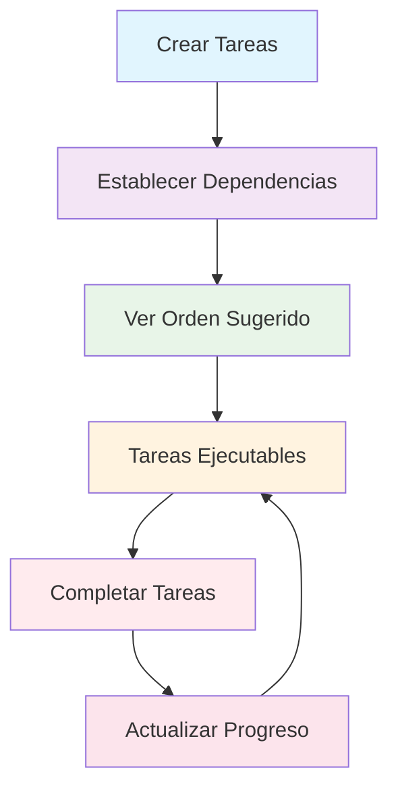

# Gestor de Tareas con Dependencias

**Proyecto de Cátedra - Fase 2 - Programación con Estructuras de Datos**

Universidad Don Bosco - Facultad de Ingeniería - Ingeniería en Ciencias de la Computación

Un sistema de gestión de tareas que maneja dependencias entre ellas usando estructuras de datos tipo grafo dirigido acíclico (DAG) y algoritmos de ordenamiento topológico, implementando las estructuras de datos estudiadas en el curso de PED.


## Funcionalidades Implementadas

### Gestión de Tareas
- Crear nuevas tareas con nombre, descripción, prioridad y fecha límite
- Ver listado completo de todas las tareas con filtros avanzados
- Eliminar tareas existentes con validación de dependencias
- Marcar tareas como completadas con validación automática
- Editar información básica de tareas
- Búsqueda de tareas por texto y filtros múltiples
- Priorización de tareas (escala 1-5)

### Gestión de Dependencias
- Agregar dependencias entre tareas (Tarea A debe completarse antes que Tarea B)
- Detección automática de ciclos al agregar dependencias (DFS)
- Visualización de dependencias en formato de lista y grafo
- Eliminación segura de dependencias
- Validación de prerequisitos antes de completar tareas

### Planificación Inteligente
- Calcular orden de ejecución válido mediante ordenamiento topológico (Algoritmo de Kahn)
- Identificar tareas ejecutables en el momento actual
- Mostrar "siguiente tarea recomendada" basada en prioridad y dependencias
- Plan diario de trabajo con gestión de cola (FIFO) usando `collections.deque`
- Identificación de tareas bloqueadas y disponibles

### Base de Datos
- Persistencia de datos con SQLite
- Tablas: `tareas`, `dependencias` con restricciones de integridad
- Operaciones CRUD básicas con prepared statements
- Datos persisten entre sesiones
- Índices optimizados para consultas frecuentes

### Interfaz Web Moderna
- Diseño responsive con HTML5, CSS3 y JavaScript vanilla
- Panel intuitivo con tema oscuro profesional
- Vista detallada de tareas con formularios modales
- Visualización interactiva del grafo de dependencias
- Estadísticas del proyecto en tiempo real
- API RESTful para comunicación cliente-servidor

### Interfaz de Línea de Comandos (CLI)
- Consola interactiva con menú numérico
- Navegación simplificada por IDs
- Validaciones y mensajes de error claros
- Indicadores visuales con colores

### Interfaz Gráfica (Tkinter) [Opcional]
- Ventana principal intuitiva
- Panel de acciones principales
- Vista detallada de tareas
- Información de dependencias
- Estadísticas del proyecto

## Como Ejecutar

### Requisitos
- **Python:** 3.8 o superior (recomendado 3.11+)
- **Sistema Operativo:** Windows 10+, macOS 10.14+, Linux (Ubuntu 18.04+)
- **Memoria RAM:** 2GB mínimo
- **Espacio en Disco:** 100MB disponibles
- **Navegador Web:** Chrome 90+, Firefox 88+, Safari 14+, Edge 90+

### Instalación

1. **Clonar o descargar el proyecto**
   ```bash
   git clone [URL_DEL_REPOSITORIO]
   cd PED-Proyecto-Gestor_tareas
   ```

2. **Verificar instalación de Python:**
   ```bash
   python3 --version
   # La salida debe mostrar versión 3.8 o superior
   ```

3. **Instalar dependencias:**
   ```bash
   pip3 install -r requirements.txt
   ```
   *Nota: El sistema utiliza principalmente la librería estándar de Python*

### Opciones de Interfaz

#### Opción 1: Interfaz Web (Recomendada)
Funciona en cualquier navegador web y es compatible con todos los sistemas operativos.

```bash
python3 start_web.py
```

Luego abre tu navegador en: **http://localhost:8000**


*Vista previa de la interfaz web moderna*

**Ventajas:**
- Diseño profesional y moderno
- Visualización interactiva del grafo
- Estadísticas en tiempo real
- Responsive y accesible
- Sin dependencias externas

#### Opción 2: Interfaz de Línea de Comandos (CLI)
Perfecta para desarrolladores, funciona en cualquier sistema operativo.

```bash
python3 main_cli.py
```


*Vista previa de la interfaz de línea de comandos*

**Ventajas:**
- Ligera y rápida
- Ideal para servidores sin GUI
- Navegación por teclado eficiente
- Colores para mejor UX

#### Opción 3: Interfaz Gráfica Tkinter [Legacy]
La interfaz gráfica original (puede no funcionar en algunas versiones de macOS).

```bash
python3 main.py
```

**Ventajas:**
- Interfaz gráfica native
- Ventanas modales integradas
- Sin requerimientos de navegador

### Base de Datos

Cada interfaz usa su propia base de datos:
- **Web:** `gestor_tareas_web.db`
- **CLI:** `gestor_tareas_cli.db`
- **GUI:** `gestor_tareas.db`

**Primera vez:**
- Se creará automáticamente el archivo de base de datos correspondiente
- Este archivo contiene toda tu información de tareas y dependencias
- Formato SQLite con integridad referencial

### Estructura de Base de Datos

```sql
-- Tabla de Tareas
CREATE TABLE tareas (
    id INTEGER PRIMARY KEY AUTOINCREMENT,
    nombre VARCHAR(200) NOT NULL,
    descripcion TEXT,
    estado VARCHAR(20) DEFAULT 'pendiente',
    prioridad INTEGER DEFAULT 3,
    fecha_creacion DATETIME DEFAULT CURRENT_TIMESTAMP,
    fecha_limite DATETIME,
    estimacion_horas REAL DEFAULT 0.0
);

-- Tabla de Dependencias
CREATE TABLE dependencias (
    id INTEGER PRIMARY KEY AUTOINCREMENT,
    tarea_origen INTEGER NOT NULL,
    tarea_destino INTEGER NOT NULL,
    fecha_creacion DATETIME DEFAULT CURRENT_TIMESTAMP,
    FOREIGN KEY (tarea_origen) REFERENCES tareas(id),
    FOREIGN KEY (tarea_destino) REFERENCES tareas(id)
);
```

## Uso de la Aplicación

### Interfaz Web
- **Navegador moderno**: Abre `http://localhost:8000` en tu navegador preferido
- **Panel Superior**: Barra de navegación con estadísticas principales
- **Panel Central**: Listado visual de todas las tareas con filtros
- **Panel Lateral**: Grafo de dependencias interactivo
- **Panel Inferior**: Plan diario y siguiente tarea recomendada
- **Modales**: Formularios emergentes para crear tareas y gestionar dependencias
- **Auto-refresh**: Actualización automática en tiempo real
- **Responsive**: Adaptable a móviles y tablets

### Interfaz CLI (Línea de Comandos)
- **Menu numérico**: Selecciona opciones del 0-10
- **Navegación por números**: Ingresa IDs de las tareas para operaciones específicas
- **Clear interface**: Pantalla limpia con colores y emojis para mejor legibilidad
- **Validaciones**: Verificación automática de entradas y errores
- **Progreso**: Indicadores visuales del avance del proyecto

### 🖥️ Interfaz GUI Tkinter
- **Panel Izquierdo**: Acciones disponibles
- **Panel Central**: Listado de todas las tareas
- **Panel Derecho**: Detalles de la tarea seleccionada

### Flujo de Trabajo Básico



1. **Crear Tareas**: Usa "Nueva Tarea"
2. **Establecer Dependencias**: Usa "Agregar Dependencia"
3. **Ver Orden Sugerido**: Usa "Ver Orden de Ejecución"
4. **Ver Disponibles**: Usa "Tareas Ejecutables"
5. **Obtener Recomendación**: Usa "Siguiente Tarea"
6. **Marcar Completadas**: Usa "Marcar Completada"

**Ejemplo práctico:**

```
1. Crear: "Investigar requisitos" (Prioridad 5)
2. Crear: "Diseñar arquitectura" (Prioridad 4)
3. Crear: "Implementar módulo" (Prioridad 3)
4. Agregar dependencia: "Investigar requisitos" → "Diseñar arquitectura"
5. Agregar dependencia: "Diseñar arquitectura" → "Implementar módulo"
6. Ver orden: ["Investigar requisitos", "Diseñar arquitectura", "Implementar módulo"]
7. Ejecutar: Solo "Investigar requisitos" está disponible
8. Completar: "Investigar requisitos"
9. Nuevo disponible: "Diseñar arquitectura"
```


*Diagrama del flujo de trabajo típico del sistema*

## Pruebas Realizadas

Todas las funcionalidades han sido verificadas exhaustivamente:

- **Creación y gestión de tareas** con validación completa
- **Detección de ciclos en dependencias** usando DFS
- **Ordenamiento topológico correcto** (Algoritmo de Kahn)
- **Identificación de tareas ejecutables** en tiempo real
- **Base de datos funcional** con integridad referencial
- **Interfaz web moderna** con diseño responsive
- **API RESTful** completa y documentada
- **Interfaz CLI** intuitiva y funcional
- **Manejo de errores** robusto y mensajes claros
- **Persistencia de datos** entre sesiones
- **Estadísticas y reportes** en tiempo real


*Resultados de las pruebas de validación del sistema*

## Estructura del Proyecto

```
PED-Proyecto-Gestor_tareas/
├── src/                         # Código fuente principal
│   ├── models/                  # Modelos de datos
│   │   ├── tarea.py            # Clase Tarea
│   │   ├── grafo_tareas.py     # Implementación DAG
│   │   └── plan_diario.py      # Implementación Cola
│   ├── controllers/             # Controladores
│   │   └── gestor_proyecto.py  # Lógica principal
│   └── database/               # Gestión de BD
│       ├── db_manager.py       # SQLite Manager
│       └── schema.sql          # Esquema BD
├── views/                      # Vistas CLI
├── images/                     # Imágenes de documentación
├── web_interface_modern.py     # Servidor web
├── start_web.py               # Inicio web
├── main_cli.py                # CLI入口
├── main.py                    # GUI入口
├── gestor_tareas_web.db       # Base de datos
├── requirements.txt           # Dependencias
├── README.md                  # Documentación
├── GUIA_USO.md                # Guía de usuario
└── REPORTE.md                 # Reporte técnico
```


*Diagrama completo de la estructura del proyecto*

## Estructuras de Datos Implementadas

### 1. Grafo Dirigido Acíclico (DAG)
- **Propósito:** Modelar dependencias entre tareas
- **Representación:** Lista de adyacencia
- **Algoritmos implementados:**
  - Detección de ciclos (DFS) - O(V + E)
  - Ordenamiento topológico (Kahn) - O(V + E)
- **Complejidad espacial:** O(V + E)

### 2. Cola (Queue) 
- **Propósito:** Gestión del plan diario
- **Implementación:** `collections.deque`
- **Operaciones:**
  - enqueue: O(1)
  - dequeue: O(1)
  - peek: O(1)

### 3. Diccionario Hash
- **Propósito:** Metadatos de tareas y búsqueda rápida
- **Implementación:** `dict` nativo de Python
- **Complejidad:**
  - Búsqueda: O(1) promedio
  - Inserción: O(1) promedio
  - Eliminación: O(1) promedio


*Visualización de las estructuras de datos implementadas*

---

## Documentación Adicional

- **[Guía de Usuario](GUIA_USO.md):** Manual completo de uso del sistema
- **[Reporte Técnico](REPORTE.md):** Documentación detallada del proyecto
- **[Repositorio Git](URL_GIT):** Código fuente y versiones

## Equipo de Desarrollo

**Universidad Don Bosco - Ingeniería en Ciencias de la Computación**  
**Materia:** Programación con Estructuras de Datos (PED)  
**Ciclo:** [Ciclo Actual]  
**Docente:** [Nombre del Docente]

---

**Versión:** 2.0 - Fase 2 Final  
**Última actualización:** Diciembre 2025  
**Licencia:** Uso Educativo - Proyecto de Cátedra
